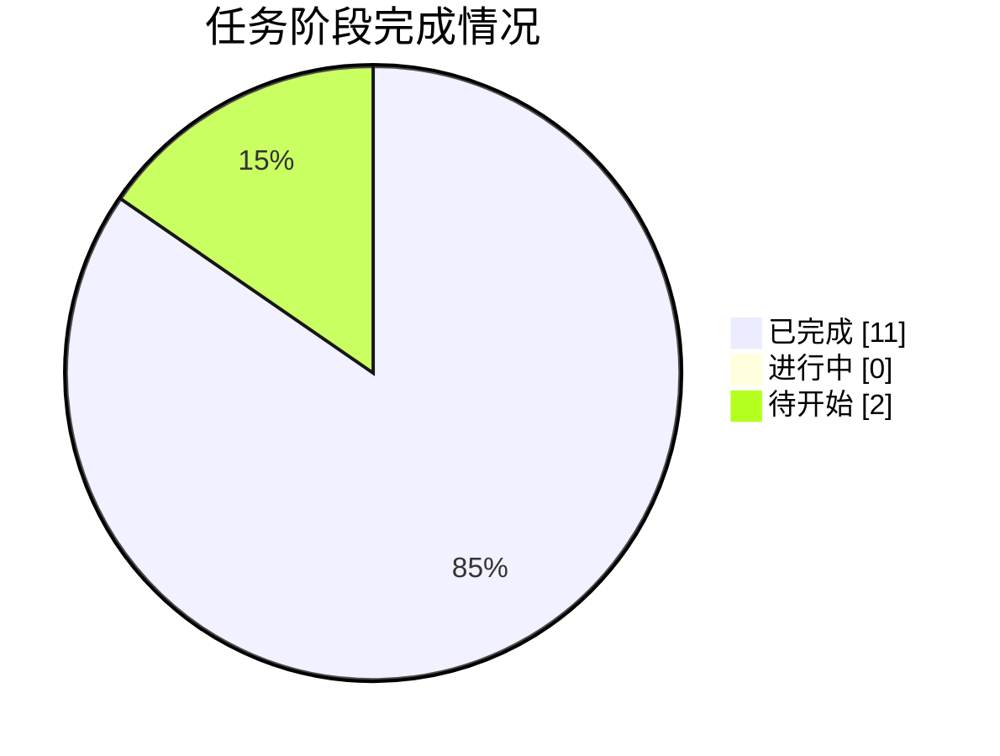

# 🚚 AAW · MathorCup 2025 赛道 B（盲测 Run-2）

**物流理赔风险识别及服务升级 —— 12-Agent 数模竞赛全流程盲测（真实派发模式）**

   

---

## 📌 项目简介

本项目用 **A0–A11 共 12 个角色化 Agent** 的流水线体系，**全盲模式**求解 **2025 年 MathorCup 数学应用挑战赛·大数据竞赛赛道 B（物流理赔风险识别及服务升级）**：基于附件 1 历史运单建立理赔风险标注模型（合理诉求 / 诉求偏高 / 严重超额 三类），预测附件 2 运单的实际赔付金额与风险标注，并完成竞赛论文。所有方法只从**赛题原文、附件数据与流水线自身产物**推导，不参考任何本题相关的外部解答。本分支（`run-2`）为**第二轮盲测**：主会话担任总控、**逐阶段真实派发**十二个子智能体（前一轮串行扮演存档于 `main` 分支），每小时自动同步一次进展，全部快照见 [reports/](reports/)。

**三问概览**：Q1 风险标注模型（附件1划分结果与分析）· Q2 实际赔付金额预测（含评估指标）· Q3 风险标注分类预测（含"严重超额"不均衡处理与两条技术路线优劣势论述）

## 🎯 当前状态

| 指标 | 值 |
|---|---|
| 当前阶段 | **A10 摘要撰写与全文润色、格式检查（全部阶段完成）** |
| 总进度 | **85%**（11 完成 / 0 进行中 / 2 待开始） |
| 最近更新 | 2026-10-05 17:00 |

## 📋 阶段进度总览

| 阶段 | 内容 | 状态 | 产物 |
|---|---|---|---|
| **G0** | 任务接收、环境自检与工作区初始化 | ✅ 完成 | 00_admin/task_board.md, 00_admin/red_lines.md, 00_admin/decisions.md, 00_admin/env_check.md, code/g0_env_check.py, output/logs/g0_env_check.log |
| **A1** | 审题：子问题拆解、目标、约束与评价指标 | ✅ 完成 | 00_admin/A1_审题.md |
| **A2** | 方法论依据与假设体系建立 | ✅ 完成 | 00_admin/A2_假设.md（假设 A2-01~20、方法论菜单 26 条；假设的数据证实/证伪由 A3 续核回填） |
| **A3** | 数据读取、清洗、缺失/异常处理与特征工程 | ✅ 完成 | code/a3_01~07_*.py, output/logs/a3_01~07*.log, 00_admin/A3_数据报告.md（含 §8 假设核验回填）, output/tables/附件1_clean.csv, output/tables/附件2_clean.csv |
| **A4** | 三问模型设计（变量/目标/约束/规则） | ✅ 完成 | 00_admin/A4_模型设计.md（决策建议 D12–D21 已仲裁采纳） |
| **A5** | 求解算法与评估方案设计 | ✅ 完成 | 00_admin/A5_算法方案.md（V1–V8 数值化、评估契约、回退触发器 R-01–R-10） |
| **A6** | 代码实现、实验与结果产出（含 Result_提交.xlsx） | ✅ 完成 | code/a6_common.py, a6_q23_common.py, a6_01~06_*.py, output/logs/a6_*.log+阻断上报, output/Result_提交.xlsx, output/tables/q1_*/q2_*/q3_*/附件2_*（R-04/R-07 已仲裁 D24/D25） |
| **A7** | 结果分析、误差、敏感性与稳健性 | ✅ 完成 | 00_admin/A7_结果分析.md（9 节+8 条局限+给 A9 的 6 条表述红线）, code/a7_01~05_*.py, output/logs/a7_*.log, output/tables/a7_*.csv |
| **A8** | 论文级图表设计与产出 | ✅ 完成 | output/figures/fig1~fig8（8 张 300dpi，含 fig8 翻转带敏感性）、figures_清单.md（图注+章节映射），code/a8_*.py + 日志 |
| **A9** | 竞赛论文正文撰写 | ✅ 完成 | paper/论文.md（53.1KB；六项核验全过、约 120 个数字点溯源、11 处事实性修正） |
| **A10** | 摘要撰写与全文润色、格式检查 | ✅ 完成 | paper/摘要.md（865 字）, paper/论文.md（56.2KB，摘要占位已替换）, paper/论文.docx（177 段/6 表/8 图）, code/a10_01~02_*.py, output/logs/a10_*.log（自检五项 PASS，含裸 LaTeX 0 残片） |
| **A11** | 独立质控：复现、一致性、合规终审 | ⬜ 待开始 | output/logs/qa_check.md, output/logs/qa_programmatic.log |
| **G9** | 交付打包与最终清单核对 | ⬜ 待开始 | output/交付清单.md |

## 🏆 成果展示

- [📄 论文与文档](deliverables/paper/) · [📈 图表](deliverables/figures/) · [📦 提交结果](deliverables/result/)
- 结果摘要：[deliverables/result/result_摘要.md](deliverables/result/result_摘要.md)（A6 完成后可用）
- 关键模型结论：见 [PROGRESS.md](PROGRESS.md)「关键模型结论」小节（随阶段实测更新）

## 🗂 目录导航

| 路径 | 内容 |
|---|---|
| [PROGRESS.md](PROGRESS.md) | 进度台账：阶段明细、关键结论、同步时间线 |
| [reports/](reports/) | 每小时同步快照（含台账/看板/决策原文存档），最新见 [LATEST.md](reports/LATEST.md) |
| [docs/](docs/) | 管理文档镜像：任务看板 / 决策记录 / 进度 / 数据报告（A3 后） |
| [deliverables/](deliverables/) | 成果镜像：代码 / 论文 / 管理文档 / 图表 / 表格 / 提交结果 |
| [sync/](sync/) | 自动同步脚本（可复现同步过程） |

---

本分支由 sync_to_github.py 每小时自动同步 · 数据源为工作区 STATE.md · 竞赛原始数据不入库 · main 分支为前轮存档

