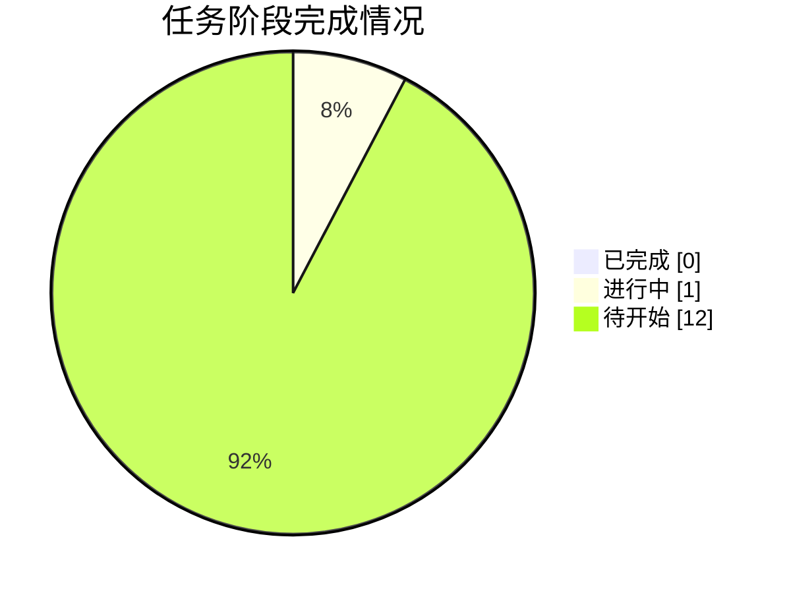

# 📸 同步快照 · 2026-10-04 18:27

> 由 `sync/sync_to_github.py` 自动生成 | 数据源：`agent_workspace_B1/STATE.md`

## 本轮概要

| 指标 | 值 |
|---|---|
| 当前进度 | **4%** |
| 已完成阶段 | 0 |
| 进行中阶段 | 1 |
| 待开始阶段 | 12 |
| 当前阶段 | G0 任务接收、环境自检与工作区初始化 |

### 本轮镜像的成果文件

- **代码**：0 个文件
- **论文与阶段文档**：0 个文件
- **管理文档**：0 个文件
- **图表**：0 个文件
- **结果表格**：0 个文件
- **日志与QA**：0 个文件
- **提交结果**：0 个文件

## 阶段状态表

| 阶段 | 内容 | 状态 | 产物 |
|---|---|---|---|
| **G0** | 任务接收、环境自检与工作区初始化 | 🔄 进行中 | 00_admin/task_board.md |
| **A1** | 审题：子问题拆解、目标、约束与评价指标 | ⬜ 待开始 | 00_admin/A1_审题.md |
| **A2** | 方法论依据检索与假设体系建立 | ⬜ 待开始 | 00_admin/A2_假设.md |
| **A3** | 数据读取、清洗、缺失/异常处理与特征工程 | ⬜ 待开始 | code/01_*.py, 00_admin/A3_数据报告.md |
| **A4** | 三问模型设计（变量/目标/约束/规则） | ⬜ 待开始 | 00_admin/A4_模型设计.md |
| **A5** | 求解算法与评估方案设计 | ⬜ 待开始 | 00_admin/A5_算法方案.md |
| **A6** | 代码实现、实验与结果产出（含 Result_提交.xlsx） | ⬜ 待开始 | code/*.py, output/tables, output/Result_提交.xlsx |
| **A7** | 结果分析、误差、敏感性与稳健性 | ⬜ 待开始 | 00_admin/A7_结果分析.md |
| **A8** | 论文级图表设计与产出 | ⬜ 待开始 | output/figures/*.png |
| **A9** | 竞赛论文正文撰写 | ⬜ 待开始 | paper/论文.md |
| **A10** | 摘要撰写与全文润色、格式检查 | ⬜ 待开始 | paper/论文.docx, paper/摘要.md |
| **A11** | 独立质控：复现、一致性、合规终审 | ⬜ 待开始 | output/logs/qa_check.md |
| **G9** | 交付打包与最终清单核对 | ⬜ 待开始 | output/交付清单.md |



---

## 附：STATE.md 台账原文

```markdown
# STATE.md —— 盲测 Run-1 进度台账（唯一进度权威）

> 仓库：https://github.com/J-met77/AAW-mathorcup-2025-B-1 ｜ 由 A0 chief-orchestrator 维护，每小时同步脚本解析本文件。

## 1. 任务概要

- **赛题**：2025 MathorCup 大数据竞赛赛道 B —— 物流理赔风险识别及服务升级问题（3 问）
- **模式**：全盲模拟参赛（不得检索任何与本题解答相关的信息，方法只从赛题原文、附件数据与流水线自身产物推导）
- **交付物**：`output/Result_提交.xlsx`（附件2运单号 + 实际赔付金额 + 风险标注）、`paper/论文.docx|.md`、可复跑代码、QA 终审记录
- **工作区**：`C:\Users\21732\Desktop\2025b论文\agent_workspace_B1\`

## 2. 数据事实

（A3 数据工程师勘察后填写；在此之前本节留空。）

## 3. 关键决策

| 编号 | 决策 | 理由 | 提出方 |
|---|---|---|---|
| D00 | 建立盲测工作区 agent_workspace_B1，与既往任何工作区物理隔离 | 保证盲测纯净：方法只能来自题面、数据与自身产物 | 主会话 |

（后续决策由 A0 追加，编号 D01、D02……）

## 4. 关键模型结论

（随 A4-A7 阶段更新，仅记录已实测数字，禁止写未经验证的预期。）

## 5. 阶段状态

| 阶段 | 内容 | 状态 | 产物 |
|---|---|---|---|
| G0 | 任务接收、环境自检与工作区初始化 | IN_PROGRESS | 00_admin/task_board.md |
| A1 | 审题：子问题拆解、目标、约束与评价指标 | PENDING | 00_admin/A1_审题.md |
| A2 | 方法论依据检索与假设体系建立 | PENDING | 00_admin/A2_假设.md |
| A3 | 数据读取、清洗、缺失/异常处理与特征工程 | PENDING | code/01_*.py, 00_admin/A3_数据报告.md |
| A4 | 三问模型设计（变量/目标/约束/规则） | PENDING | 00_admin/A4_模型设计.md |
| A5 | 求解算法与评估方案设计 | PENDING | 00_admin/A5_算法方案.md |
| A6 | 代码实现、实验与结果产出（含 Result_提交.xlsx） | PENDING | code/*.py, output/tables, output/Result_提交.xlsx |
| A7 | 结果分析、误差、敏感性与稳健性 | PENDING | 00_admin/A7_结果分析.md |
| A8 | 论文级图表设计与产出 | PENDING | output/figures/*.png |
| A9 | 竞赛论文正文撰写 | PENDING | paper/论文.md |
| A10 | 摘要撰写与全文润色、格式检查 | PENDING | paper/论文.docx, paper/摘要.md |
| A11 | 独立质控：复现、一致性、合规终审 | PENDING | output/logs/qa_check.md |
| G9 | 交付打包与最终清单核对 | PENDING | output/交付清单.md |

## 6. 当前状态

- **当前阶段**：G0 环境自检
- **下一步**：A0 读取赛题原文，确认 A1-A11 调度方式（真实子代理 or 串行扮演），记录决策 D01
- **待办**：全部流水线阶段

```

## 附：任务看板原文

```markdown
# 任务看板 · 盲测 Run-1

| Agent | 任务 | 依赖 | 状态 | 备注 |
|---|---|---|---|---|
| A0 chief-orchestrator | 总控：拆解、调度、门禁、仲裁 | - | 🔄 进行中 | 维护 STATE.md |
| A1 problem-analyst | 审题与拆解 | A0 | ⬜ 待开始 | |
| A2 literature-assumption | 通用方法论检索与假设 | A1 | ⬜ 待开始 | 只许检索通用方法，禁止检索本题 |
| A3 data-engineer | 数据勘察/清洗/特征 | A1 | ⬜ 待开始 | |
| A4 model-designer | 三问模型设计 | A2,A3 | ⬜ 待开始 | |
| A5 algorithm-solver | 算法与评估设计 | A4 | ⬜ 待开始 | |
| A6 implementation-coder | 实现与结果产出 | A5 | ⬜ 待开始 | |
| A7 result-analyst | 结果/敏感性/稳健性 | A6 | ⬜ 待开始 | |
| A8 visualization-designer | 论文级图表 | A6 | ⬜ 待开始 | |
| A9 paper-writer | 论文正文 | A7,A8 | ⬜ 待开始 | |
| A10 abstract-polisher | 摘要与润色 | A9 | ⬜ 待开始 | |
| A11 qa-reproducer | 独立复现与终审 | A10 | ⬜ 待开始 | 只读不改 |
| G9 | 交付打包 | A11 | ⬜ 待开始 | |

```

## 附：决策记录原文

```markdown
# 决策记录 · 盲测 Run-1

> 约定：每条决策含 编号/内容/理由/提出方/时间。方法性决策必须写明"从题面/数据/自身实验的哪条证据推出"。

| 编号 | 决策 | 理由 | 提出方 | 时间 |
|---|---|---|---|---|
| D00 | 建立盲测工作区 agent_workspace_B1，与既往任何工作区物理隔离 | 保证盲测纯净：方法只能来自题面、数据与自身产物 | 主会话 | 2026-10-04 |

```
