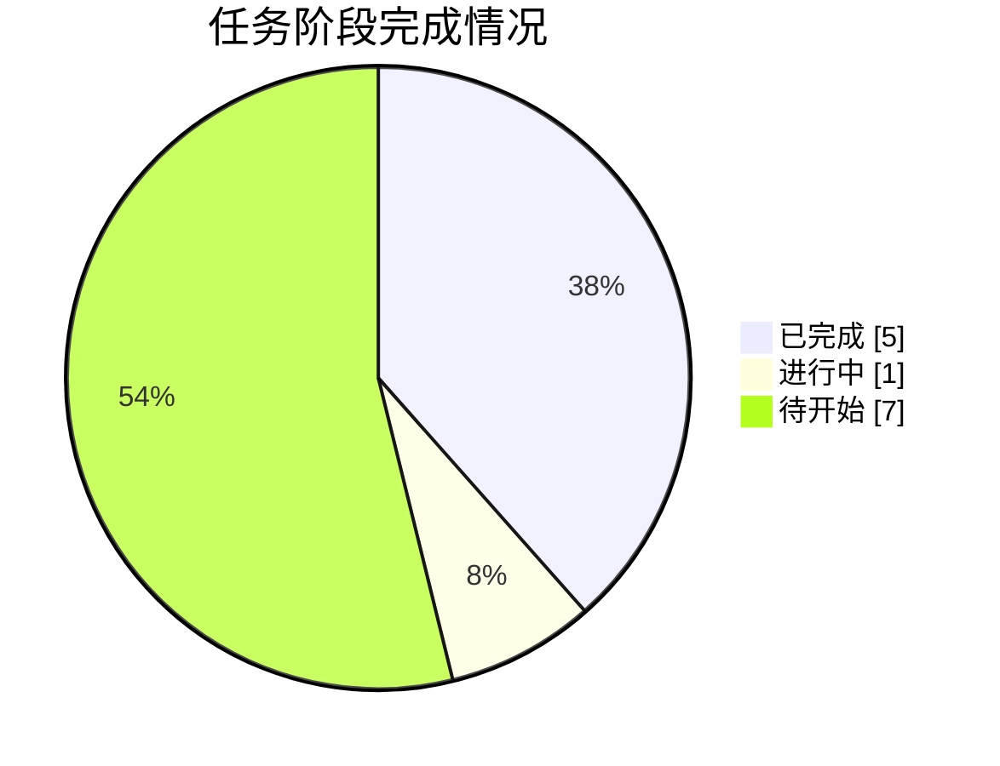

# 📸 同步快照 · 2026-10-04 19:01

> 由 `sync/sync_to_github.py` 自动生成 | 数据源：`agent_workspace_B1/STATE.md`

## 本轮概要

| 指标 | 值 |
|---|---|
| 当前进度 | **42%** |
| 已完成阶段 | 5 |
| 进行中阶段 | 1 |
| 待开始阶段 | 7 |
| 当前阶段 | A5 求解算法与评估方案设计 |

### 本轮镜像的成果文件

- **代码**：8 个文件
- **论文与阶段文档**：0 个文件
- **管理文档**：5 个文件
- **图表**：0 个文件
- **结果表格**：10 个文件
- **日志与QA**：8 个文件
- **提交结果**：0 个文件

## 阶段状态表

| 阶段 | 内容 | 状态 | 产物 |
|---|---|---|---|
| **G0** | 任务接收、环境自检与工作区初始化 | ✅ 完成 | 00_admin/task_board.md, 00_admin/decisions.md(D01/D02) |
| **A1** | 审题：子问题拆解、目标、约束与评价指标 | ✅ 完成 | 00_admin/A1_审题.md |
| **A2** | 方法论依据检索与假设体系建立 | ✅ 完成 | 00_admin/A2_假设.md |
| **A3** | 数据读取、清洗、缺失/异常处理与特征工程 | ✅ 完成 | code/01~05_*.py, output/logs/01~05*.log, 00_admin/A3_数据报告.md, output/tables/附件1_clean.csv, output/tables/附件2_clean.csv |
| **A4** | 三问模型设计（变量/目标/约束/规则） | ✅ 完成 | 00_admin/A4_模型设计.md |
| **A5** | 求解算法与评估方案设计 | 🔄 进行中 | 00_admin/A5_算法方案.md |
| **A6** | 代码实现、实验与结果产出（含 Result_提交.xlsx） | ⬜ 待开始 | code/*.py, output/tables, output/Result_提交.xlsx |
| **A7** | 结果分析、误差、敏感性与稳健性 | ⬜ 待开始 | 00_admin/A7_结果分析.md |
| **A8** | 论文级图表设计与产出 | ⬜ 待开始 | output/figures/*.png |
| **A9** | 竞赛论文正文撰写 | ⬜ 待开始 | paper/论文.md |
| **A10** | 摘要撰写与全文润色、格式检查 | ⬜ 待开始 | paper/论文.docx, paper/摘要.md |
| **A11** | 独立质控：复现、一致性、合规终审 | ⬜ 待开始 | output/logs/qa_check.md |
| **G9** | 交付打包与最终清单核对 | ⬜ 待开始 | output/交付清单.md |



---

## 附：STATE.md 台账原文

```markdown
# STATE.md —— 盲测 Run-1 进度台账（唯一进度权威）

> 仓库：https://github.com/J-met77/AAW-mathorcup-2025-B-1 ｜ 由 A0 chief-orchestrator 维护，每小时同步脚本解析本文件。

## 1. 任务概要

- **赛题**：2025 MathorCup 大数据竞赛赛道 B —— 物流理赔风险识别及服务升级问题（3 问）
- **模式**：全盲模拟参赛（不得检索任何与本题解答相关的信息，方法只从赛题原文、附件数据与流水线自身产物推导）
- **交付物**：`output/Result_提交.xlsx`（附件2运单号 + 实际赔付金额 + 风险标注）、`paper/论文.docx|.md`、可复跑代码、QA 终审记录
- **工作区**：`C:\Users\21732\Desktop\2025b论文\agent_workspace_B1\`

## 2. 数据事实

- **附件1**：11168×25 原始（含 1 行嵌入英文变量名行）→ 有效 **11167×25**，无运单号列；目标列 实际赔付金额。
- **附件2**：2793×25 原始（含 1 行嵌入英文行）→ 有效 **2792×25**，运单号 1..2792 无重复；无实际赔付金额列。
- **Result.xlsx**：2792×3，列 = 运单号 / 实际赔付金额(全空) / 风险标注(全空)；运单号与附件2**逐行完全一致**（代码验证 True）。
- 索赔差额 = 实际赔付 − 索赔金额 **恒为负**（max=-0.08, min=-4463.58）；实际赔付 ∈[0.74, 3171.47]；索赔金额 ∈[100, 5498.77]。
- 超额索赔额 u=索赔−赔付：median 282.94；u 的 q85/q97 随赔付十分位从 238/533 单调升至 2501/3594（支撑题面 C5）。
- 赔付率 r=赔付/索赔：median 0.375；赔付>100 元各箱 r_q85≈0.71-0.77 近水平，赔付≤100 受"索赔≥100"下限结构性扭曲 → 边界须含绝对量下限项。
- **无天然密度谷**（u/log1p(u)/r 直方均平滑）→ 三类标注规则须按题面约束 C1-C9 主动构造。
- 缺失：异常原因 48.6%（=未提报，填 NoReport）、进线渠道 0.84%（填 Unknown），其余 0 缺失。
- 陷阱：保价金额 7.72% 负值∈[-1,0)（置0+标记）；配送超时 65.5% 饱和带 [427000,428000]（+标记）；妥投到进线时长 25.4% 负值、8.6% >1e8（+标记+log|·|）；万单理赔率负值 ~9-11%（+标记）；网点发单量 33~1e10（log1p）；新旧程度含未文档化 -1（43.95%，按类别）。
- 附件1 vs 附件2 类别比例差 ≤1.5pp，无显著漂移；附件2 有 2 个新目的城市、132 个新寄件人id、177 个新收件人id（编码须容忍未见值）。
- Spearman(实际赔付, 特征)：索赔金额 0.807（主力特征）、保价金额 0.338，其余弱。
- 干净数据集：output/tables/附件1_clean.csv（11167×49，含目标与 22 衍生列）、附件2_clean.csv（2792×47）。
- 勘察日志：output/logs/01~05*.log（事实均可溯源）。

## 3. 关键决策

| 编号 | 决策 | 理由 | 提出方 |
|---|---|---|---|
| D00 | 建立盲测工作区 agent_workspace_B1，与既往任何工作区物理隔离 | 保证盲测纯净：方法只能来自题面、数据与自身产物 | 主会话 |
| D01 | 调度模式：A0 串行扮演 A1-A11 | G0 实测本会话无 Task 工具，按契约降级为串行扮演 | A0 |
| D02 | A2 检索范围锁定为通用方法论，禁止检索本题解答 | 盲测红线第2条 | A0 |
| D03 | 问题3 提交以"直接分类"路线为主结果，路线B 仅作对比论述 | 题面问题3 条款要求分类模型提交、路线B 为论述对象 | A4 |
| D04 | Q1 规则参数起点 τ1=0.86, τ2=0.98，网格内按 S1-S4 择优 | C2/C3 软约束反推+数据事实 | A4 |

（后续决策由 A0 追加，编号 D05、D06……）

## 4. 关键模型结论

（随 A4-A7 阶段更新，仅记录已实测数字，禁止写未经验证的预期。）

## 5. 阶段状态

| 阶段 | 内容 | 状态 | 产物 |
|---|---|---|---|
| G0 | 任务接收、环境自检与工作区初始化 | DONE | 00_admin/task_board.md, 00_admin/decisions.md(D01/D02) |
| A1 | 审题：子问题拆解、目标、约束与评价指标 | DONE | 00_admin/A1_审题.md |
| A2 | 方法论依据检索与假设体系建立 | DONE | 00_admin/A2_假设.md |
| A3 | 数据读取、清洗、缺失/异常处理与特征工程 | DONE | code/01~05_*.py, output/logs/01~05*.log, 00_admin/A3_数据报告.md, output/tables/附件1_clean.csv, output/tables/附件2_clean.csv |
| A4 | 三问模型设计（变量/目标/约束/规则） | DONE | 00_admin/A4_模型设计.md |
| A5 | 求解算法与评估方案设计 | IN_PROGRESS | 00_admin/A5_算法方案.md |
| A6 | 代码实现、实验与结果产出（含 Result_提交.xlsx） | PENDING | code/*.py, output/tables, output/Result_提交.xlsx |
| A7 | 结果分析、误差、敏感性与稳健性 | PENDING | 00_admin/A7_结果分析.md |
| A8 | 论文级图表设计与产出 | PENDING | output/figures/*.png |
| A9 | 竞赛论文正文撰写 | PENDING | paper/论文.md |
| A10 | 摘要撰写与全文润色、格式检查 | PENDING | paper/论文.docx, paper/摘要.md |
| A11 | 独立质控：复现、一致性、合规终审 | PENDING | output/logs/qa_check.md |
| G9 | 交付打包与最终清单核对 | PENDING | output/交付清单.md |

## 6. 当前状态

- **当前阶段**：A4 模型设计（串行扮演模式，见 D01）
- **下一步**：A4 产出 00_admin/A4_模型设计.md（Q1 规则数学定义 + Q2 回归方案 + Q3 分类与不均衡策略）
- **待办**：A5→A6→A7/A8→A9→A10→A11→G9

```

## 附：任务看板原文

```markdown
# 任务看板 · 盲测 Run-1

| Agent | 任务 | 依赖 | 状态 | 备注 |
|---|---|---|---|---|
| A0 chief-orchestrator | 总控：拆解、调度、门禁、仲裁 | - | 🔄 进行中 | 维护 STATE.md |
| A1 problem-analyst | 审题与拆解 | A0 | ⬜ 待开始 | |
| A2 literature-assumption | 通用方法论检索与假设 | A1 | ⬜ 待开始 | 只许检索通用方法，禁止检索本题 |
| A3 data-engineer | 数据勘察/清洗/特征 | A1 | ⬜ 待开始 | |
| A4 model-designer | 三问模型设计 | A2,A3 | ⬜ 待开始 | |
| A5 algorithm-solver | 算法与评估设计 | A4 | ⬜ 待开始 | |
| A6 implementation-coder | 实现与结果产出 | A5 | ⬜ 待开始 | |
| A7 result-analyst | 结果/敏感性/稳健性 | A6 | ⬜ 待开始 | |
| A8 visualization-designer | 论文级图表 | A6 | ⬜ 待开始 | |
| A9 paper-writer | 论文正文 | A7,A8 | ⬜ 待开始 | |
| A10 abstract-polisher | 摘要与润色 | A9 | ⬜ 待开始 | |
| A11 qa-reproducer | 独立复现与终审 | A10 | ⬜ 待开始 | 只读不改 |
| G9 | 交付打包 | A11 | ⬜ 待开始 | |

```

## 附：决策记录原文

```markdown
# 决策记录 · 盲测 Run-1

> 约定：每条决策含 编号/内容/理由/提出方/时间。方法性决策必须写明"从题面/数据/自身实验的哪条证据推出"。

| 编号 | 决策 | 理由 | 提出方 | 时间 |
|---|---|---|---|---|
| D00 | 建立盲测工作区 agent_workspace_B1，与既往任何工作区物理隔离 | 保证盲测纯净：方法只能来自题面、数据与自身产物 | 主会话 | 2026-10-04 |
| D01 | 调度模式：A0 串行扮演 A1-A11（非真实子代理派发） | G0 实测本会话工具集仅含 Bash/Edit/Read/TodoWrite/Write/RespondToCoordinator，Task 工具不存在，按契约降级为串行扮演；各产物文档开头标注"由 A0 串行扮演 A{n}" | A0 | 2026-10-04 |
| D02 | A2 检索范围锁定为通用方法论（类不均衡处理、回归评估、约束阈值划分等一般性方法），且仅在需要时离线引用通用知识，不联网检索本题 | 盲测红线第2条：禁止检索与本题解答相关的任何信息 | A0 | 2026-10-04 |
| D03 | 问题3 提交结果采用"直接分类"路线（路线A）为主结果；"回归+规则判定"（路线B）仅作同折对比与论文论述 | 题面问题3 明示"使用问题1规则+附件1数据建立风险标注的分类模型，预测附件2风险标注"为提交内容，路线B 是题面给出的对比论述对象（Q4） | A4 | 2026-10-04 |
| D04 | Q1 规则参数起点 τ1=0.86, τ2=0.98，最终在 τ1∈[0.85,0.90], τ2∈[0.97,0.99] 网格内按 S1-S4 验收准则择优 | 题面 C2/C3 软约束（合理≥85%、严重<3%）反推并留缓冲；数据事实 A3（u 分位数随 p 单调、纯比值形态受索赔≥100 下限扭曲） | A4 | 2026-10-04 |

```
