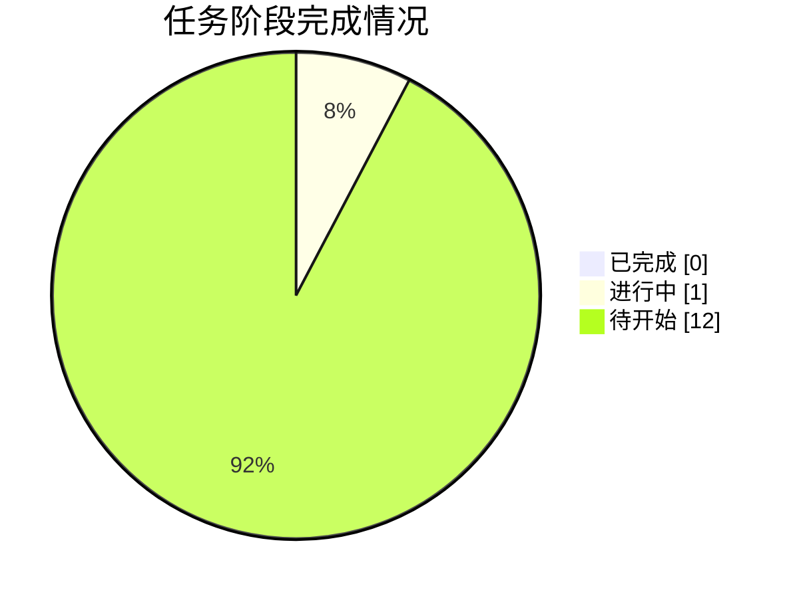

# 📸 同步快照 · 2026-10-04 20:27

> 由 `sync/sync_to_github.py` 自动生成 | 数据源：`agent_workspace_B2/STATE.md`

## 本轮概要

| 指标 | 值 |
|---|---|
| 当前进度 | **4%** |
| 已完成阶段 | 0 |
| 进行中阶段 | 1 |
| 待开始阶段 | 12 |
| 当前阶段 | G0 任务接收、环境自检与工作区初始化 |

### 本轮镜像的成果文件

- **代码**：0 个文件
- **论文与阶段文档**：0 个文件
- **管理文档**：0 个文件
- **图表**：0 个文件
- **结果表格**：0 个文件
- **日志与QA**：0 个文件
- **提交结果**：0 个文件

## 阶段状态表

| 阶段 | 内容 | 状态 | 产物 |
|---|---|---|---|
| **G0** | 任务接收、环境自检与工作区初始化 | 🔄 进行中 | 00_admin/task_board.md, 00_admin/red_lines.md, 00_admin/decisions.md |
| **A1** | 审题：子问题拆解、目标、约束与评价指标 | ⬜ 待开始 | 00_admin/A1_审题.md |
| **A2** | 方法论依据与假设体系建立 | ⬜ 待开始 | 00_admin/A2_假设.md |
| **A3** | 数据读取、清洗、缺失/异常处理与特征工程 | ⬜ 待开始 | code/*.py, output/logs/, 00_admin/A3_数据报告.md, output/tables/附件1_clean.csv, output/tables/附件2_clean.csv |
| **A4** | 三问模型设计（变量/目标/约束/规则） | ⬜ 待开始 | 00_admin/A4_模型设计.md |
| **A5** | 求解算法与评估方案设计 | ⬜ 待开始 | 00_admin/A5_算法方案.md |
| **A6** | 代码实现、实验与结果产出（含 Result_提交.xlsx） | ⬜ 待开始 | code/*.py, output/logs/, output/Result_提交.xlsx |
| **A7** | 结果分析、误差、敏感性与稳健性 | ⬜ 待开始 | 00_admin/A7_结果分析.md, output/tables/ |
| **A8** | 论文级图表设计与产出 | ⬜ 待开始 | output/figures/ |
| **A9** | 竞赛论文正文撰写 | ⬜ 待开始 | paper/论文.md |
| **A10** | 摘要撰写与全文润色、格式检查 | ⬜ 待开始 | paper/摘要.md, paper/论文.docx |
| **A11** | 独立质控：复现、一致性、合规终审 | ⬜ 待开始 | output/logs/qa_check.md, output/logs/qa_programmatic.log |
| **G9** | 交付打包与最终清单核对 | ⬜ 待开始 | output/交付清单.md |



---

## 附：STATE.md 台账原文

```markdown
# STATE.md —— 盲测 Run-2 进度台账（唯一进度权威）

> 仓库：https://github.com/J-met77/AAW-mathorcup-2025-B-1 （**run-2 分支**，main 为 Run-1 存档）｜ 由主会话统一维护，每小时同步脚本解析本文件。

## 1. 任务概要

- **赛题**：2025 MathorCup 大数据竞赛赛道 B —— 物流理赔风险识别及服务升级问题（3 问）
- **模式**：全盲模拟参赛（不得检索任何与本题解答相关的信息，方法只从赛题原文、附件数据与流水线自身产物推导）
- **调度**：主会话担任总控，**真实派发**十二个子智能体（A0 承担 G0 规划与 G9 收尾，A1–A11 逐阶段独立派发）
- **交付物**：`output/Result_提交.xlsx`（附件2运单号 + 实际赔付金额 + 风险标注）、`paper/论文.docx|.md`、可复跑代码、QA 终审记录
- **工作区**：`C:\Users\21732\Desktop\2025b论文\agent_workspace_B2\`
- **红线**：见 `00_admin/red_lines.md`（G0 固化），全阶段继承

## 2. 数据事实

- （待 A3 阶段回填：结构、缺失、异常、分布、与目标关系，均须注明溯源日志）

## 3. 关键决策

| 编号 | 决策 | 理由 | 提出方 |
|---|---|---|---|
| D00 | 建立盲测工作区 agent_workspace_B2，与既往任何工作区/仓库物理隔离 | 保证盲测纯净：方法只能来自题面、数据与自身产物 | 主会话 |
| D01 | 调度模式：主会话担任总控真实派发，A0 仅承担 G0 规划与 G9 收尾，A1–A11 逐阶段独立真实派发 | 前轮曾因子代理会话缺少派发工具退化为串行扮演；本会话十二个角色均已注册可用，真实派发可兑现，且主会话可在阶段间执行门禁 | 主会话 |
| D02 | STATE.md 由主会话统一维护；子代理只写各自阶段产物，不碰台账 | 避免并行写冲突与格式漂移破坏同步脚本解析 | 主会话 |
| D03 | 同步目标为本仓库 **run-2 孤立分支**（main 保持前轮存档，互不覆盖） | 无新建仓库权限；孤立分支实现两轮成果物理隔离，目录仍清晰 | 主会话 |
| D04 | 全程离线：不联网检索，A2 仅引用自身已掌握的通用方法论知识并注明"通用方法论，非本题资料" | 盲测红线：禁止检索任何与本题解答相关的信息；离线纪律保证与既有运行唯一变量为调度模式 | 主会话 |

（后续决策由主会话按阶段追加，编号 D05、D06……）

## 4. 关键模型结论

- （待回填：仅记录已实测数字，每个数字注明产生它的脚本与日志）

## 5. 阶段状态

| 阶段 | 内容 | 状态 | 产物 |
|---|---|---|---|
| G0 | 任务接收、环境自检与工作区初始化 | IN_PROGRESS | 00_admin/task_board.md, 00_admin/red_lines.md, 00_admin/decisions.md |
| A1 | 审题：子问题拆解、目标、约束与评价指标 | PENDING | 00_admin/A1_审题.md |
| A2 | 方法论依据与假设体系建立 | PENDING | 00_admin/A2_假设.md |
| A3 | 数据读取、清洗、缺失/异常处理与特征工程 | PENDING | code/*.py, output/logs/, 00_admin/A3_数据报告.md, output/tables/附件1_clean.csv, output/tables/附件2_clean.csv |
| A4 | 三问模型设计（变量/目标/约束/规则） | PENDING | 00_admin/A4_模型设计.md |
| A5 | 求解算法与评估方案设计 | PENDING | 00_admin/A5_算法方案.md |
| A6 | 代码实现、实验与结果产出（含 Result_提交.xlsx） | PENDING | code/*.py, output/logs/, output/Result_提交.xlsx |
| A7 | 结果分析、误差、敏感性与稳健性 | PENDING | 00_admin/A7_结果分析.md, output/tables/ |
| A8 | 论文级图表设计与产出 | PENDING | output/figures/ |
| A9 | 竞赛论文正文撰写 | PENDING | paper/论文.md |
| A10 | 摘要撰写与全文润色、格式检查 | PENDING | paper/摘要.md, paper/论文.docx |
| A11 | 独立质控：复现、一致性、合规终审 | PENDING | output/logs/qa_check.md, output/logs/qa_programmatic.log |
| G9 | 交付打包与最终清单核对 | PENDING | output/交付清单.md |

## 6. 当前状态

- **当前阶段**：G0 进行中（真实派发模式启动）
- **待办**：G0 规划产物 → A1 审题 → A2/A3 → A4 → A5 → A6 → A7/A8 → A9 → A10 → 视觉终检 → A11 → G9

```

## 附：任务看板原文

```markdown
（尚未建立）
```

## 附：决策记录原文

```markdown
（尚未建立）
```
