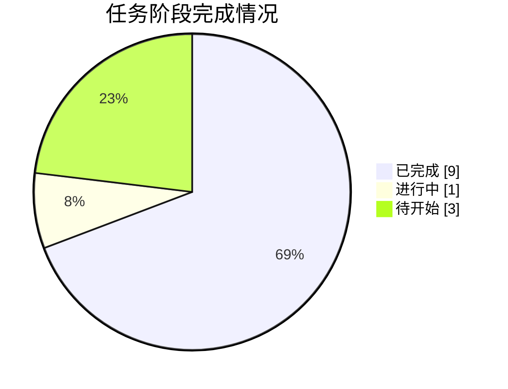

# 📸 同步快照 · 2026-10-05 13:00

> 由 `sync/sync_to_github.py` 自动生成 | 数据源：`agent_workspace_B2/STATE.md`

## 本轮概要

| 指标 | 值 |
|---|---|
| 当前进度 | **73%** |
| 已完成阶段 | 9 |
| 进行中阶段 | 1 |
| 待开始阶段 | 3 |
| 当前阶段 | A9 竞赛论文正文撰写 |

### 本轮镜像的成果文件

- **代码**：31 个文件
- **论文与阶段文档**：1 个文件
- **管理文档**：9 个文件
- **图表**：8 个文件
- **结果表格**：27 个文件
- **日志与QA**：29 个文件
- **提交结果**：1 个文件

## 阶段状态表

| 阶段 | 内容 | 状态 | 产物 |
|---|---|---|---|
| **G0** | 任务接收、环境自检与工作区初始化 | ✅ 完成 | 00_admin/task_board.md, 00_admin/red_lines.md, 00_admin/decisions.md, 00_admin/env_check.md, code/g0_env_check.py, output/logs/g0_env_check.log |
| **A1** | 审题：子问题拆解、目标、约束与评价指标 | ✅ 完成 | 00_admin/A1_审题.md |
| **A2** | 方法论依据与假设体系建立 | ✅ 完成 | 00_admin/A2_假设.md（假设 A2-01~20、方法论菜单 26 条；假设的数据证实/证伪由 A3 续核回填） |
| **A3** | 数据读取、清洗、缺失/异常处理与特征工程 | ✅ 完成 | code/a3_01~07_*.py, output/logs/a3_01~07*.log, 00_admin/A3_数据报告.md（含 §8 假设核验回填）, output/tables/附件1_clean.csv, output/tables/附件2_clean.csv |
| **A4** | 三问模型设计（变量/目标/约束/规则） | ✅ 完成 | 00_admin/A4_模型设计.md（决策建议 D12–D21 已仲裁采纳） |
| **A5** | 求解算法与评估方案设计 | ✅ 完成 | 00_admin/A5_算法方案.md（V1–V8 数值化、评估契约、回退触发器 R-01–R-10） |
| **A6** | 代码实现、实验与结果产出（含 Result_提交.xlsx） | ✅ 完成 | code/a6_common.py, a6_q23_common.py, a6_01~06_*.py, output/logs/a6_*.log+阻断上报, output/Result_提交.xlsx, output/tables/q1_*/q2_*/q3_*/附件2_*（R-04/R-07 已仲裁 D24/D25） |
| **A7** | 结果分析、误差、敏感性与稳健性 | ✅ 完成 | 00_admin/A7_结果分析.md（9 节+8 条局限+给 A9 的 6 条表述红线）, code/a7_01~05_*.py, output/logs/a7_*.log, output/tables/a7_*.csv |
| **A8** | 论文级图表设计与产出 | ✅ 完成 | output/figures/fig1~fig8（8 张 300dpi，含 fig8 翻转带敏感性）、figures_清单.md（图注+章节映射），code/a8_*.py + 日志 |
| **A9** | 竞赛论文正文撰写 | 🔄 进行中 | paper/论文.md |
| **A10** | 摘要撰写与全文润色、格式检查 | ⬜ 待开始 | paper/摘要.md, paper/论文.docx |
| **A11** | 独立质控：复现、一致性、合规终审 | ⬜ 待开始 | output/logs/qa_check.md, output/logs/qa_programmatic.log |
| **G9** | 交付打包与最终清单核对 | ⬜ 待开始 | output/交付清单.md |



---

## 附：STATE.md 台账原文

```markdown
# STATE.md —— 盲测 Run-2 进度台账（唯一进度权威）

> 仓库：https://github.com/J-met77/AAW-mathorcup-2025-B-1 （**run-2 分支**，main 为 Run-1 存档）｜ 由主会话统一维护，每小时同步脚本解析本文件。

## 1. 任务概要

- **赛题**：2025 MathorCup 大数据竞赛赛道 B —— 物流理赔风险识别及服务升级问题（3 问）
- **模式**：全盲模拟参赛（不得检索任何与本题解答相关的信息，方法只从赛题原文、附件数据与流水线自身产物推导）
- **调度**：主会话担任总控，**真实派发**十二个子智能体（A0 承担 G0 规划与 G9 收尾，A1–A11 逐阶段独立派发）
- **交付物**：`output/Result_提交.xlsx`（附件2运单号 + 实际赔付金额 + 风险标注）、`paper/论文.docx|.md`、可复跑代码、QA 终审记录
- **工作区**：`C:\Users\21732\Desktop\2025b论文\agent_workspace_B2\`
- **红线**：见 `00_admin/red_lines.md`（G0 固化），全阶段继承

## 2. 数据事实

- （待 A3 阶段回填：结构、缺失、异常、分布、与目标关系，均须注明溯源日志）

## 3. 关键决策

| 编号 | 决策 | 理由 | 提出方 |
|---|---|---|---|
| D00 | 建立盲测工作区 agent_workspace_B2，与既往任何工作区/仓库物理隔离 | 保证盲测纯净：方法只能来自题面、数据与自身产物 | 主会话 |
| D01 | 调度模式：主会话担任总控真实派发，A0 仅承担 G0 规划与 G9 收尾，A1–A11 逐阶段独立真实派发 | 前轮曾因子代理会话缺少派发工具退化为串行扮演；本会话十二个角色均已注册可用，真实派发可兑现，且主会话可在阶段间执行门禁 | 主会话 |
| D02 | STATE.md 由主会话统一维护；子代理只写各自阶段产物，不碰台账 | 避免并行写冲突与格式漂移破坏同步脚本解析 | 主会话 |
| D03 | 同步目标为本仓库 **run-2 孤立分支**（main 保持前轮存档，互不覆盖） | 无新建仓库权限；孤立分支实现两轮成果物理隔离，目录仍清晰 | 主会话 |
| D04 | 全程离线：不联网检索，A2 仅引用自身已掌握的通用方法论知识并注明"通用方法论，非本题资料" | 盲测红线：禁止检索任何与本题解答相关的信息；离线纪律保证与既有运行唯一变量为调度模式 | 主会话 |
| D05 | 缺失工具替代路径：statsmodels/seaborn/pandoc 缺失；统计推断用 scipy/sklearn 等价实现，图表纯 matplotlib，md→docx 用 python-docx | G0 环境自检实测（code/g0_env_check.py + output/logs/g0_env_check.log），核心库齐备，不阻塞任何阶段 | A0(G0) |
| D06 | matplotlib 中文渲染基准字体 SimHei / Microsoft YaHei（备选 DengXian、KaiTi）；A8 图表须 rcParams 显式设置中文字体并处理负号 | 自检命中 11 个常用中文字体；显式设置保证各阶段渲染一致 | A0(G0) |
| D07 | 溯源落位约定：脚本一律 code/、日志一律 output/logs/、报告一律 00_admin/，作为红线第 6 条的执行范例 | 统一落位便于 A11 程序化终审 | A0(G0) |
| D08 | 本机 pandas 3.0.5 / numpy 2.5.3：A3/A6 禁用旧版已废弃 API，兼容性以本环境实测为准 | 提前立项避免复跑不一致 | A0(G0) |
| D09 | 仲裁采纳 A1 歧义解读：D1"理赔差额"="索赔差额"同一量（A3 以数据确认列名）；D3 问题2 评估口径=附件1 验证框架作说明；D4"问题2中方法"=题面方式1完整链路（预测赔付→与索赔比较→判类）；D8 附表1 未列索赔金额/实际赔付金额列，A3 勘察确认实际列存在性 | 与题面条款一致且不预设数据结论；数据侧确认交 A3 | 主会话(仲裁) |
| D10 | 调度抗中断策略：长阶段子代理一律后台派发（run_in_background）+ TaskOutput 阻塞等待；整点同步自动化注入会取消前台挂起的派发调用（事故 #2），后台派发不受影响 | 21:00 整点自动化实测取消了一次前台 A3 派发；同步改由阶段间隙手动/自动补跑 | 主会话 |
| D11 | 采纳 A3 续核警示：①A4 设计必须显式声明所用的差额/超额坐标系（绝对超额 vs 相对超额，二者单调方向相反，见 T6b）；②A5/A6 评估须在标准分层 K 折外增设按行序外推留出的稳健性对照（附件1 行序存在赔付中位漂移，U3，p=0.0091）；③论文对特征信息量的表述以 T5 为准（索赔金额 |r|=0.81 一枝独秀，其余 ≤0.29） | A3 续核对 A2-04/14/17 的部分证实结论给出数据证据；防止验证结论对切分方式敏感而未察觉 | 主会话(仲裁) |

| D12–D21 | 仲裁采纳 A4 决策建议十条：D12 主用绝对超额坐标系(x,e=−索赔差额)、相对口径对偶报告；D13 Q1 主规则=等频分箱条件分位数+跨箱保序单调化（M1-5/M1-4/M1-1 各司对照/核验/消融）；D14 τ 初值 0.85/0.97 软校准非硬截断；D15 Q2 树集成主族+log10/原尺度双变体验证裁决；D16 强制基线 B1–B4、须胜 B3/B4 才主张价值；D17 Q3 主路线=方式2 直接分类进 result、方式1 完整链路作对比；D18 不均衡=类权重+阈值/先验校正两级杠杆+消融、评估在未重采样折上；D19 Q2/Q3 双切分口径（分层5折+行序外推）结论须一致；D20 Q1 规则输入仅 索赔差额+实际赔付金额；D21 附件2_clean 按 附件1 同式补算 索赔金额_log10（A3 执行，已落盘） | 每条均有题面条款/T,U 事实/A2 编号证据，详见 A4_模型设计.md 决策建议表 | 主会话(仲裁) |
| D22 | 下游读取契约：两份 clean.csv 为 utf-8-sig（带 BOM），A6–A11 读取必须 `encoding="utf-8-sig"`；附件2_clean 终版 2792×47、运单号置首（A3 修复 a3_06 列序根因缺陷后重跑链 a3_03→a3_06→a3_08，md5 0846d4b0，其余列逐格不变） | A3 补列时发现列序缺陷与 BOM 前缀风险，逐格校验通过后固化为契约 | 主会话(仲裁) |

| D23 | A6 阻断上报仲裁（V6② bootstrap 翻转率 1.0298% vs 约定门槛 1%）：采纳预案甲——维持 θ*=(B=5, τ1=0.86, τ2=0.98) 冻结边界与附件1 全量标注，论文与自检表如实报告该超限（相对超出 3.0%，集中于边界带样本） | 门槛为 A5 约定项而非题面要求；L0–L5 择优不以 V6 为目标，为过门槛重择属目标篡改；边界带翻转是分位边界固有不确定度（A2-20）；A7 须做翻转带敏感性分析佐证 | 主会话(仲裁) |
| D24 | R-04 仲裁（Q3 杠杆收益双口径反转，分层 0.6704>0.6529 而行序 0.6710<0.6922）：采纳预案乙——主配置维持进 Result（嵌套校准为预注册准则）；论文双口径分别如实报告；"两级杠杆提升宏F1"的结论限定于分层口径；方式2>方式1 的路线级结论双口径一致不受影响 | 预注册择优准则不因事后对比方向反转而更改；D19 双口径如实报告即满足；行序外推反映 U3 漂移机制的更苛场景，限定结论范围是诚实做法 | 主会话(仲裁) |
| D25 | R-07 仲裁（Q3 概率标定 log loss 0.2386 劣于 A0 0.2208）：维持主配置不换 M3-6——消融 A6 实测宏F1 仅 0.4298 且严重占比 9.9% 破 C2 带，机械换族恶化主指标；log loss 差距记录为 M3-4 均衡权重的结构性失准，写入 A7/论文局限 | 主指标口径（宏F1+严重类召回）为 A4/A5 契约所定；回退候选实测更差；如实记录局限优于静默换法 | 主会话(仲裁) |

（后续决策由主会话按阶段追加，编号 D26、D27……）

## 4. 关键模型结论

- **Q1 冻结规则**（output/tables/q1_定稿配置.json、q1_边界表.csv、日志 a6_01）：绝对超额坐标系 e=−索赔差额、x=实际赔付金额等频 5 箱，箱内 τ1=0.86/τ2=0.98 分位 + PAVA 保序；序贯判定 e≥g2(x)→严重超额、e≥g1(x)→偏高、否则合理。附件1 占比 **85.99% / 12.00% / 2.01%**（9602/1340/225）；V1–V5/V7/V8 PASS，V6② bootstrap 翻转率 1.0298% 超 1% 约定门槛（D23 如实报告）；密度判据 D_geo=52.84；对偶相对口径三分位 0.6255/0.8408/0.9461（q1_对偶报告.csv）。
- **Q2 回归**（q2_指标汇总.csv，日志 a6_02/03/04）：变体A log10+smearing 定稿（LGBM 77 树，φ=1.182165）；分层 5 折×3 种子池化 WAPE 0.3398/0.3398/0.3406（主种子 95%CI [0.3347,0.3463]）、行序外推 0.3357；基线 B1/B2/B3/B4=0.6810/0.7236/0.4560/0.4099 全部显著劣于变体A（D16 成立）；Huber 变体B 0.5571~0.5573 淘汰；XGBoost 对照 0.3440/0.3381；ElasticNet 0.3420、OLS 0.3424（行序 OLS 0.3334 略优于 LGBM，如实报告供 A7 讨论）。
- **Q3 分类**（q3_指标汇总.csv、q3_消融矩阵.csv，日志 a6_05）：方式2 直接分类主配置（嵌套校准 γ*=0、s*=(1.00,2.00)）分层宏F1 0.6704/0.6521/0.6586（95%CI [0.6466,0.6928]）、严重类 recall 0.3200 / precision 0.4768、行序 0.6710；方式1（回归+规则）分层 0.6362/0.6358/0.6369（严重 recall 仅 0.173）、行序 0.6643——**方式2>方式1 双口径一致**（D17 成立）；消融：无杠杆 A0 分层 0.6529 但行序 0.6922 反转（D24 限定杠杆结论于分层口径）；均衡集成 A6 0.4298 且严重占比 9.9% 破带；R-07 标定失准 log loss 0.2386 vs 0.2208（D25 记录为局限）。
- **附件2 推断**（附件2_赔付预测.csv、附件2_风险预测.csv）：赔付 min 8.12 / max 1455.73 元（无保价截断，T9）；方式2 预测占比 **合理 90.19% / 偏高 9.10% / 严重 0.72%**（2518/254/20，如实报告未硬凑 C2 带）；两路线标签一致率 0.9864。
- **提交自检**（日志 a6_06）：Result_提交.xlsx（md5 a66012ea）2792×3，运单号与模板逐行一致零改动、两列无空值、金额非负两位小数、标签合法；幂等复跑 8376 格逐格一致。
- **A7 分析结论**（A7_结果分析.md，日志 a7_01~05）：V6② 翻转率 1.0298% 为**边界固有不确定度**——τ 邻域翻转率同量级、94.7% 翻转质量集中于 4.2% 贴边界行、转移仅相邻类（支撑 D23）；D24 反转为**两个不显著效应骑跨零点**（bootstrap P(Δ>0)=0.844/0.283，分层收益全靠严重类、行序下 n_严=44 支撑过小）；Q2 可预测部分主要由索赔金额近对数线性结构承载（单特征 log-log 即达 0.4545，线性族到 LGBM 仅 +0.002），残差异方差且有向；Q3 两路线错误均集中 Q1 边界邻域（错行 d_min 中位 0.131 vs 对行 0.674，MW p≈0，与 V6② 同根），95.0% 混淆为相邻类。

## 5. 阶段状态

| 阶段 | 内容 | 状态 | 产物 |
|---|---|---|---|
| G0 | 任务接收、环境自检与工作区初始化 | DONE | 00_admin/task_board.md, 00_admin/red_lines.md, 00_admin/decisions.md, 00_admin/env_check.md, code/g0_env_check.py, output/logs/g0_env_check.log |
| A1 | 审题：子问题拆解、目标、约束与评价指标 | DONE | 00_admin/A1_审题.md |
| A2 | 方法论依据与假设体系建立 | DONE | 00_admin/A2_假设.md（假设 A2-01~20、方法论菜单 26 条；假设的数据证实/证伪由 A3 续核回填） |
| A3 | 数据读取、清洗、缺失/异常处理与特征工程 | DONE | code/a3_01~07_*.py, output/logs/a3_01~07*.log, 00_admin/A3_数据报告.md（含 §8 假设核验回填）, output/tables/附件1_clean.csv, output/tables/附件2_clean.csv |
| A4 | 三问模型设计（变量/目标/约束/规则） | DONE | 00_admin/A4_模型设计.md（决策建议 D12–D21 已仲裁采纳） |
| A5 | 求解算法与评估方案设计 | DONE | 00_admin/A5_算法方案.md（V1–V8 数值化、评估契约、回退触发器 R-01–R-10） |
| A6 | 代码实现、实验与结果产出（含 Result_提交.xlsx） | DONE | code/a6_common.py, a6_q23_common.py, a6_01~06_*.py, output/logs/a6_*.log+阻断上报, output/Result_提交.xlsx, output/tables/q1_*/q2_*/q3_*/附件2_*（R-04/R-07 已仲裁 D24/D25） |
| A7 | 结果分析、误差、敏感性与稳健性 | DONE | 00_admin/A7_结果分析.md（9 节+8 条局限+给 A9 的 6 条表述红线）, code/a7_01~05_*.py, output/logs/a7_*.log, output/tables/a7_*.csv |
| A8 | 论文级图表设计与产出 | DONE | output/figures/fig1~fig8（8 张 300dpi，含 fig8 翻转带敏感性）、figures_清单.md（图注+章节映射），code/a8_*.py + 日志 |
| A9 | 竞赛论文正文撰写 | IN_PROGRESS | paper/论文.md |
| A10 | 摘要撰写与全文润色、格式检查 | PENDING | paper/摘要.md, paper/论文.docx |
| A11 | 独立质控：复现、一致性、合规终审 | PENDING | output/logs/qa_check.md, output/logs/qa_programmatic.log |
| G9 | 交付打包与最终清单核对 | PENDING | output/交付清单.md |

## 6. 当前状态

- **当前阶段**：A9 竞赛论文正文撰写进行中（A7/A8 全部 DONE：8 图+分析报告+6 条表述红线就绪）
- **待办**：A9 → A10 → 视觉终检 → A11 → G9

```

## 附：任务看板原文

```markdown
# 任务看板 —— 盲测 Run-2（13 阶段）

> 维护方：A0（G0 建立）；状态权威仍为 `STATE.md`（主会话维护），本看板是阶段职责/门禁的执行细则。
> 阶段产物路径与 `STATE.md` §5 产物列一致。红线见 `00_admin/red_lines.md`，**每阶段 briefing 必须原文包含**。
> 全部路径相对工作区 `C:\Users\21732\Desktop\2025b论文\agent_workspace_B2\`。

## 调度约束（主会话执行）

- 串行主干：G0 → A1 → (A2 ∥ A3) → A4 → A5 → A6 → (A7 ∥ A8) → A9 → A10 → A11 → G9。
- **A1 完成并通过门禁后，A2 与 A3 可并行派发**；二者互不依赖，但都只依赖 A1 与 data/。
- **A6 完成并通过门禁后，A7 与 A8 可并行派发**；二者都以 A6 产物为输入。
- 其余阶段一律串行；A4 必须等 A2、A3 均通过门禁；A9 必须等 A7、A8 均通过门禁。
- 每阶段门禁由主会话核查，不通过即打回该阶段返工，不得带病放行。

## 门禁通用条款（各阶段叠加执行）

- 通用-1：产物落位与 STATE.md §5 产物列一致，无占位符（"待定/TBD/TODO"等视为未完成）。
- 通用-2：关键数字可溯源（脚本文件名 + 日志文件名，日志落 `output/logs/`）。
- 通用-3：引用来源仅限 `00_admin/red_lines.md` 第 2 条白名单；引用通用方法论知识时须标注"通用方法论，非本题资料"。
- 通用-4：不修改 `STATE.md`、不越权写其他阶段专属目录。

---

## G0 任务接收、环境自检与工作区初始化（A0）

- 职责目标：固化红线、核验环境与数据文件开放性、建立看板与决策台账、初始化目录。
- 输入：data/ 四文件、主会话任务卡。
- 输出：`00_admin/red_lines.md`、`00_admin/task_board.md`、`00_admin/decisions.md`、`00_admin/env_check.md`（补充产物）；溯源 `code/g0_env_check.py` + `output/logs/g0_env_check.log`。
- 验收门禁：
  1. 四个 admin 文件齐备、无占位符；
  2. 环境自检有脚本+日志溯源，缺库事实已记入 decisions.md；
  3. data/ 四文件存在性、可打开性、sheet 名与行列数已记录（不做内容分析）；
  4. 红线含污染源路径清单与离线纪律，声明"各阶段 briefing 必须原文包含"。

## A1 审题：子问题拆解、目标、约束与评价指标

- 职责目标：逐段吃透题面，把三问拆成可建模、可验收的子问题；提取全部显式约束、交付格式要求与评价指标。
- 输入：`data/赛题原文.md`（唯一题面来源）；不得依据题面之外的任何资料。
- 输出：`00_admin/A1_审题.md`。
- 验收门禁：
  1. 三问逐问覆盖题面全部问项，与原文逐问核对无遗漏（附条款出处/段落引用）；
  2. 每个子问题的目标、约束、评价指标均注明"题面哪条条款"；
  3. 明确提交物格式要求（列名、行口径等以题面为准），供 A6/G9 核验引用；
  4. 不出现题面之外的方法性结论或假设性数字。

## A2 方法论依据与假设体系建立

- 职责目标：建立全流水线的假设清单与方法论依据，界定每条假设的适用范围与风险。
- 输入：`00_admin/A1_审题.md`。
- 输出：`00_admin/A2_假设.md`。
- 验收门禁：
  1. 每条假设标注依据类型：题面条款 / 数据事实（待 A3 回填证实或证伪）/ 通用方法论（并标注"通用方法论，非本题资料"）；
  2. 假设之间无逻辑矛盾，且不与 A1 提取的题面约束冲突；
  3. 给出"若被 A3 证伪的回退预案"字段；
  4. 无外部资料引用痕迹（红线第 2 条）。

## A3 数据读取、清洗、缺失/异常处理与特征工程

- 职责目标：把附件 1/附件 2 变成可建模的干净数据集，产出数据事实报告，回填 A2 假设的证实/证伪结论。
- 输入：`data/附件1.xlsx`、`data/附件2.xlsx`、`data/Result.xlsx`、`00_admin/A1_审题.md`、`00_admin/A2_假设.md`。
- 输出：`code/*.py`、`output/logs/`、`00_admin/A3_数据报告.md`、`output/tables/附件1_clean.csv`、`output/tables/附件2_clean.csv`。
- 验收门禁：
  1. 清洗前后行数、删除/填补规则全部记录于日志，脚本可从 data/ 原始文件一键复现两份 clean.csv；
  2. `附件2_clean.csv` 运单条数与附件 2 原始运单条数一致（清洗不得丢失运单，仅按题面口径处理字段）；
  3. 数据报告中的每个统计数字均有脚本+日志溯源；
  4. 对 A2 假设逐条给出"证实/证伪/待定"结论；
  5. 缺失/异常处理不引入无依据的臆造值（规则须写明）。

## A4 三问模型设计（变量/目标/约束/规则）

- 职责目标：为三问分别给出模型结构设计：变量、目标、约束、规则/机制。
- 输入：`00_admin/A1_审题.md`、`00_admin/A2_假设.md`（含 A3 回填结论）、`00_admin/A3_数据报告.md`。
- 输出：`00_admin/A4_模型设计.md`。
- 验收门禁：
  1. 三问每问均有明确的决策变量/输入变量、目标、约束与规则，且与 A1 的评价指标一一对应；
  2. 引用的字段名与 `output/tables/*_clean.csv` 实际字段一致；
  3. 每处设计选择注明依据（题面条款/数据事实/A2 假设编号）；
  4. 不引入 A1–A3 之外的新假设而不申报（新假设须补录进 A4 并标注）。

## A5 求解算法与评估方案设计

- 职责目标：把 A4 的模型落成可执行的算法方案与评估/验证方案。
- 输入：`00_admin/A4_模型设计.md`。
- 输出：`00_admin/A5_算法方案.md`。
- 验收门禁：
  1. 每问算法有流程/伪代码、输入输出定义与可行性说明（含本机环境可行性，引用 `00_admin/env_check.md` 库可用性）；
  2. 评估方案的指标定义、划分方式、随机种子等可执行、可复现；
  3. 阈值/占比等超参数给出"由题面约束+数据证据确定"的确定机制，不得凭空设数；
  4. 若方案依赖缺失库（如 statsmodels），须给出基于可用库的等价实现路径。

## A6 代码实现、实验与结果产出（含 Result_提交.xlsx）

- 职责目标：实现 A5 方案，跑通三问实验，产出提交文件与全部实验日志。
- 输入：`output/tables/*_clean.csv`、`00_admin/A4_模型设计.md`、`00_admin/A5_算法方案.md`。
- 输出：`code/*.py`、`output/logs/`、`output/Result_提交.xlsx`。
- 验收门禁：
  1. `output/Result_提交.xlsx` 的行数与运单号同 `附件2_clean.csv` 逐行一致，列结构符合 A1 提取的提交格式要求；
  2. 金额/标注字段满足题面口径（非负、格式、取值范围等以 A1 结论为准），程序化校验通过并留日志；
  3. 全流程从 clean.csv 到提交文件可重跑，重跑结果与提交文件数字一致（留复跑日志）；
  4. 关键数字（模型得分、阈值、占比等）均有脚本+日志溯源；
  5. 代码无联网调用、无工作区外读写（红线第 1、3 条）。

## A7 结果分析、误差、敏感性与稳健性

- 职责目标：解读 A6 结果，给出误差来源、敏感性、稳健性分析。
- 输入：`code/*.py`、`output/logs/`、`output/Result_提交.xlsx`（A6 产物）。
- 输出：`00_admin/A7_结果分析.md`、`output/tables/`。
- 验收门禁：
  1. 分析只使用 A6 已产出的数字，不出现无溯源的新数字；
  2. 每项敏感性/稳健性实验有对应脚本与日志（落 `output/logs/`）；
  3. 结论与 A1 的评价指标口径一致，不夸大不臆断。

## A8 论文级图表设计与产出

- 职责目标：设计并产出论文用图（结构图、数据图、结果图）。
- 输入：A6/A7 产物（数字与表格）。
- 输出：`output/figures/`。
- 验收门禁：
  1. 每图可由 `code/` 脚本重新生成，脚本与日志留痕；
  2. 中文字体渲染核验通过（引用 `00_admin/env_check.md` 第 5 节字体结论，rcParams 显式设置）；
  3. 图内数字与 A6/A7 产物一致；每图有编号与标题；
  4. 纯 matplotlib 实现（seaborn 缺失，见 decisions.md D05）。

## A9 竞赛论文正文撰写

- 职责目标：按竞赛论文结构撰写正文（问题重述、假设、符号、模型建立求解、结果分析、评价推广等）。
- 输入：`00_admin/A1–A5` 各文档、`output/tables/`、`output/figures/`、`00_admin/A7_结果分析.md`。
- 输出：`paper/论文.md`。
- 验收门禁：
  1. 三问完整覆盖，模型描述与 A4/A5 一致；
  2. 正文所有数字与 `output/` 产物一致（抽查可溯源至日志）；
  3. 假设表述与 A2 一致；图表引用编号与 `output/figures/` 实际文件对应；
  4. 无占位符、无外部资料引用痕迹。

## A10 摘要撰写与全文润色、格式检查

- 职责目标：撰写竞赛摘要，全文润色与格式合规检查，产出 docx。
- 输入：`paper/论文.md`。
- 输出：`paper/摘要.md`、`paper/论文.docx`。
- 验收门禁：
  1. 摘要覆盖三问方法与关键结果数字，且数字与正文、`output/` 产物一致；
  2. md → docx 转换用 python-docx 实现（pandoc 缺失，见 decisions.md D05），docx 可打开、标题/表格/图片完整；
  3. 格式符合 A1 提取的题面格式要求（页数、字体、匿名等条款以题面为准）；
  4. 全文无占位符。

## A11 独立质控：复现、一致性、合规终审

- 职责目标：以独立视角复核全流水线：复现实验、核对一致性、审查红线合规。
- 输入：全部前序产物。
- 输出：`output/logs/qa_check.md`、`output/logs/qa_programmatic.log`。
- 验收门禁：
  1. 程序化核验通过：`output/Result_提交.xlsx` 行数与运单号同 `附件2_clean.csv` 逐行一致；关键数字抽样复现一致；
  2. 复现核验通过：按 `code/` 脚本顺序重跑，结果与提交产物一致（留日志）；
  3. 红线合规终审通过：产物引用均出自 `00_admin/red_lines.md` 第 2 条白名单，无联网痕迹，关键数字均有溯源；
  4. 发现问题须出具"打回单"（指明阶段与不合格条款），不得代为修改专业产物。

## G9 交付打包与最终清单核对（A0）

- 职责目标：汇总最终提交包，核对清单，交人类队长确认提交。
- 输入：全部产物、`output/logs/qa_check.md`。
- 输出：`output/交付清单.md`。
- 验收门禁：
  1. 清单与实际文件一一对应（逐文件存在性与大小核对）；
  2. 必交付物齐备：`output/Result_提交.xlsx`、`paper/论文.docx`（及 `paper/论文.md`、`paper/摘要.md`）、`code/` 可复跑脚本、`output/logs/` 关键日志、QA 终审记录；
  3. A11 门禁结论为"通过"（或问题已闭环）；
  4. 提醒人类队长遵守竞赛 AI 使用规定并如实申报（人类职责，流水线只提醒）。

```

## 附：决策记录原文

```markdown
# 决策记录 —— 盲测 Run-2

> 维护约定：`STATE.md` §3 由主会话统一维护；本文件是 A0 在 G0 建立的决策台账副本与扩展记录。
> D00–D04 转录自 `STATE.md` §3（提出方=主会话）；D05 起为 A0 在 G0 阶段基于自检事实新增，
> **供主会话审核后转录进 STATE.md §3**。列：编号 / 决策 / 理由 / 提出方 / 时间。

| 编号 | 决策 | 理由 | 提出方 | 时间 |
|---|---|---|---|---|
| D00 | 建立盲测工作区 agent_workspace_B2，与既往任何工作区/仓库物理隔离 | 保证盲测纯净：方法只能来自题面、数据与自身产物 | 主会话 | 转录自 STATE.md §3（G0，2026-10-04） |
| D01 | 调度模式：主会话担任总控真实派发，A0 仅承担 G0 规划与 G9 收尾，A1–A11 逐阶段独立真实派发 | 前轮曾因子代理会话缺少派发工具退化为串行扮演；本会话十二个角色均已注册可用，真实派发可兑现，且主会话可在阶段间执行门禁 | 主会话 | 转录自 STATE.md §3（G0，2026-10-04） |
| D02 | STATE.md 由主会话统一维护；子代理只写各自阶段产物，不碰台账 | 避免并行写冲突与格式漂移破坏同步脚本解析 | 主会话 | 转录自 STATE.md §3（G0，2026-10-04） |
| D03 | 同步目标为本仓库 run-2 孤立分支（main 保持前轮存档，互不覆盖） | 无新建仓库权限；孤立分支实现两轮成果物理隔离，目录仍清晰 | 主会话 | 转录自 STATE.md §3（G0，2026-10-04） |
| D04 | 全程离线：不联网检索，A2 仅引用自身已掌握的通用方法论知识并注明"通用方法论，非本题资料" | 盲测红线：禁止检索任何与本题解答相关的信息；离线纪律保证与既有运行唯一变量为调度模式 | 主会话 | 转录自 STATE.md §3（G0，2026-10-04） |
| D05 | 缺失工具的替代路径：statsmodels 与 seaborn 未安装、pandoc 不在 PATH；后续阶段一律基于可用库实现——A5/A7 的统计推断类需求用 scipy/sklearn 等价实现或由主会话决定是否安装，A8 图表纯 matplotlib，A10 的 md→docx 用 python-docx | G0 自检实测：statsmodels、seaborn import 失败，pandoc 不存在；核心库 numpy/pandas/sklearn/scipy/matplotlib/openpyxl/python-docx/lightgbm/xgboost 全部可用。溯源：`code/g0_env_check.py` + `output/logs/g0_env_check.log` | A0（G0） | 2026-10-04 |
| D06 | matplotlib 中文渲染基准字体定为 SimHei / Microsoft YaHei（备选 DengXian、KaiTi）；A8 所有图表须在 rcParams 显式设置中文字体并处理负号显示 | G0 自检实测命中 SimHei、Microsoft YaHei 等 11 个常用中文字体，中文图表无字体障碍；显式设置可避免各阶段渲染不一致。溯源：`output/logs/g0_env_check.log` 第 4 节 | A0（G0） | 2026-10-04 |
| D07 | 环境自检落位约定：脚本 `code/g0_env_check.py`、日志 `output/logs/g0_env_check.log`、报告 `00_admin/env_check.md`；此三件构成"关键数字/事实须有脚本+日志溯源"（红线第 6 条）的首个范例，供 A3/A6/A7/A11 引用执行 | G0 产出需可核查；统一 code/ 与 output/logs/ 落位便于 A11 程序化终审 | A0（G0） | 2026-10-04 |
| D08 | 本机 pandas 为 3.0.5（3.x 大版本）、numpy 2.5.3：A3/A6 编码不得沿用 pandas 1.x/2.x 已废弃 API（如 `DataFrame.append`、隐式 downcasting 等），一切兼容性以本环境实测为准 | G0 自检实测版本；3.x 与旧教程代码存在行为差异，提前立项避免 A6 复跑不一致。溯源：`output/logs/g0_env_check.log` 第 1 节 | A0（G0） | 2026-10-04 |

## G0 发现摘要（供主会话派发简报引用）

1. **数据文件开放性**：附件1.xlsx（sheet1，11169×25）、附件2.xlsx（Sheet1，2794×25）、Result.xlsx（Sheet1，2793×3）、赛题原文.md（91 行 utf-8）全部可正常打开——A3 可直接开工。行列数为 openpyxl 表维（通常含表头），精确口径由 A3 核实。
2. **影响调度的缺库事实**：statsmodels、seaborn、pandoc 缺失（见 D05），已给出替代路径，不阻塞任何阶段的派发。
3. **并行窗口提醒**：A1 通过门禁后即可同时派发 A2、A3；A6 通过门禁后即可同时派发 A7、A8（详见 `00_admin/task_board.md` 调度约束）。

```
