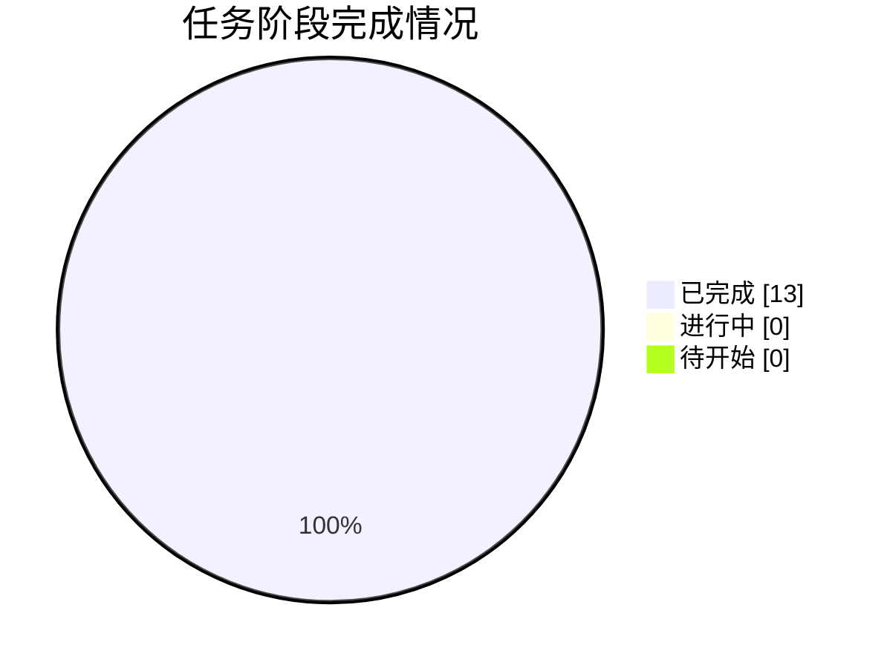

# 📸 同步快照 · 2026-10-05 17:01

> 由 `sync/sync_to_github.py` 自动生成 | 数据源：`agent_workspace_B1/STATE.md`

## 本轮概要

| 指标 | 值 |
|---|---|
| 当前进度 | **100%** |
| 已完成阶段 | 13 |
| 进行中阶段 | 0 |
| 待开始阶段 | 0 |
| 当前阶段 | G9 交付打包与最终清单核对（全部阶段完成） |

### 本轮镜像的成果文件

- **代码**：14 个文件
- **论文与阶段文档**：3 个文件
- **管理文档**：6 个文件
- **图表**：8 个文件
- **结果表格**：15 个文件
- **日志与QA**：15 个文件
- **提交结果**：1 个文件

## 阶段状态表

| 阶段 | 内容 | 状态 | 产物 |
|---|---|---|---|
| **G0** | 任务接收、环境自检与工作区初始化 | ✅ 完成 | 00_admin/task_board.md, 00_admin/decisions.md(D01/D02) |
| **A1** | 审题：子问题拆解、目标、约束与评价指标 | ✅ 完成 | 00_admin/A1_审题.md |
| **A2** | 方法论依据检索与假设体系建立 | ✅ 完成 | 00_admin/A2_假设.md |
| **A3** | 数据读取、清洗、缺失/异常处理与特征工程 | ✅ 完成 | code/01~05_*.py, output/logs/01~05*.log, 00_admin/A3_数据报告.md, output/tables/附件1_clean.csv, output/tables/附件2_clean.csv |
| **A4** | 三问模型设计（变量/目标/约束/规则） | ✅ 完成 | 00_admin/A4_模型设计.md |
| **A5** | 求解算法与评估方案设计 | ✅ 完成 | 00_admin/A5_算法方案.md |
| **A6** | 代码实现、实验与结果产出（含 Result_提交.xlsx） | ✅ 完成 | code/01~09_*.py, output/logs/0*.log, output/Result_提交.xlsx |
| **A7** | 结果分析、误差、敏感性与稳健性 | ✅ 完成 | 00_admin/A7_结果分析.md, code/10_sensitivity.py, output/tables/sensitivity_*.csv, q2_ablation.csv |
| **A8** | 论文级图表设计与产出 | ✅ 完成 | output/figures/fig1~fig8（8张，300dpi，统一配色） |
| **A9** | 竞赛论文正文撰写 | ✅ 完成 | paper/论文.md |
| **A10** | 摘要撰写与全文润色、格式检查 | ✅ 完成 | paper/摘要.md, paper/论文.docx, code/12_make_docx.py, code/14_md_unicode.py（视觉终检打回已修复并复验 PASS，见 D08） |
| **A11** | 独立质控：复现、一致性、合规终审 | ✅ 完成 | output/logs/qa_check.md, output/logs/qa_programmatic.log, code/13_qa_check.py |
| **G9** | 交付打包与最终清单核对 | ✅ 完成 | output/交付清单.md |



---

## 附：STATE.md 台账原文

```markdown
# STATE.md —— 盲测 Run-1 进度台账（唯一进度权威）

> 仓库：https://github.com/J-met77/AAW-mathorcup-2025-B-1 ｜ 由 A0 chief-orchestrator 维护，每小时同步脚本解析本文件。

## 1. 任务概要

- **赛题**：2025 MathorCup 大数据竞赛赛道 B —— 物流理赔风险识别及服务升级问题（3 问）
- **模式**：全盲模拟参赛（不得检索任何与本题解答相关的信息，方法只从赛题原文、附件数据与流水线自身产物推导）
- **交付物**：`output/Result_提交.xlsx`（附件2运单号 + 实际赔付金额 + 风险标注）、`paper/论文.docx|.md`、可复跑代码、QA 终审记录
- **工作区**：`C:\Users\21732\Desktop\2025b论文\agent_workspace_B1\`

## 2. 数据事实

- **附件1**：11168×25 原始（含 1 行嵌入英文变量名行）→ 有效 **11167×25**，无运单号列；目标列 实际赔付金额。
- **附件2**：2793×25 原始（含 1 行嵌入英文行）→ 有效 **2792×25**，运单号 1..2792 无重复；无实际赔付金额列。
- **Result.xlsx**：2792×3，列 = 运单号 / 实际赔付金额(全空) / 风险标注(全空)；运单号与附件2**逐行完全一致**（代码验证 True）。
- 索赔差额 = 实际赔付 − 索赔金额 **恒为负**（max=-0.08, min=-4463.58）；实际赔付 ∈[0.74, 3171.47]；索赔金额 ∈[100, 5498.77]。
- 超额索赔额 u=索赔−赔付：median 282.94；u 的 q85/q97 随赔付十分位从 238/533 单调升至 2501/3594（支撑题面 C5）。
- 赔付率 r=赔付/索赔：median 0.375；赔付>100 元各箱 r_q85≈0.71-0.77 近水平，赔付≤100 受"索赔≥100"下限结构性扭曲 → 边界须含绝对量下限项。
- **无天然密度谷**（u/log1p(u)/r 直方均平滑）→ 三类标注规则须按题面约束 C1-C9 主动构造。
- 缺失：异常原因 48.6%（=未提报，填 NoReport）、进线渠道 0.84%（填 Unknown），其余 0 缺失。
- 陷阱：保价金额 7.72% 负值∈[-1,0)（置0+标记）；配送超时 65.5% 饱和带 [427000,428000]（+标记）；妥投到进线时长 25.4% 负值、8.6% >1e8（+标记+log|·|）；万单理赔率负值 ~9-11%（+标记）；网点发单量 33~1e10（log1p）；新旧程度含未文档化 -1（43.95%，按类别）。
- 附件1 vs 附件2 类别比例差 ≤1.5pp，无显著漂移；附件2 有 2 个新目的城市、132 个新寄件人id、177 个新收件人id（编码须容忍未见值）。
- Spearman(实际赔付, 特征)：索赔金额 0.807（主力特征）、保价金额 0.338，其余弱。
- 干净数据集：output/tables/附件1_clean.csv（11167×49，含目标与 22 衍生列）、附件2_clean.csv（2792×47）。
- 勘察日志：output/logs/01~05*.log（事实均可溯源）。

## 3. 关键决策

| 编号 | 决策 | 理由 | 提出方 |
|---|---|---|---|
| D00 | 建立盲测工作区 agent_workspace_B1，与既往任何工作区物理隔离 | 保证盲测纯净：方法只能来自题面、数据与自身产物 | 主会话 |
| D01 | 调度模式：A0 串行扮演 A1-A11 | G0 实测本会话无 Task 工具，按契约降级为串行扮演 | A0 |
| D02 | A2 检索范围锁定为通用方法论，禁止检索本题解答 | 盲测红线第2条 | A0 |
| D03 | 问题3 提交以"直接分类"路线为主结果，路线B 仅作对比论述 | 题面问题3 条款要求分类模型提交、路线B 为论述对象 | A4 |
| D04 | Q1 规则参数起点 τ1=0.86, τ2=0.98，网格内按 S1-S4 择优 | C2/C3 软约束反推+数据事实 | A4 |

（后续决策由 A0 追加，编号 D05、D06……）

## 4. 关键模型结论

- **Q1 冻结规则**（rule_final.json）：M2 线性边界 T1(p)=264.87+2.482p（合理），T2(p)=850.93+3.269p（严重），τ1=0.86/τ2=0.98；附件1 占比 合理 85.97% / 偏高 11.96% / 严重 2.07%（满足题面 ≥85%、<3%）；密度对比 合理/严重=38.9倍；u 中位数三类 218/988/1950 元。
- **Q2 回归**（07 日志）：LGBM objective=L1, lr=0.05, leaves=31, mcs=20, 198树；5折 OOF MAE=95.60±2.64 元, RMSE=142.55, WAPE=32.71%；80/20 留出 MAE=100.09；基线 B0 中位数 MAE=199.02（提升51.97%），B1 log-log 线性 MAE=292.21。
- **Q3 分类**（08 日志）：路线A 最优 = 训练折内随机过采样(偏高0.5/严重0.5倍多数类)，StratifiedKFold5 宏F1=0.6350±0.0118，严重类召回0.230/精确0.366/F1 0.282；类权重方案 0.6200；先验校正方案 0.6203。路线B(回归+规则) 宏F1=0.5586，严重召回仅 0.022 —— 两路线对比：路线A 宏F1 高 0.076、严重类检出高 10 倍。
- **附件2 推断**（09 日志）：赔付预测 median=209.00/mean=267.61/max=1335.98；风险标注提交分布 合理 89.58% / 偏高 9.03% / 严重 1.40%；路线B 参考分布 严重仅 0.04%。
- 提交自检通过：2792 行、运单号与模板逐行一致、无空值、标签合法、赔付非负。

## 5. 阶段状态

| 阶段 | 内容 | 状态 | 产物 |
|---|---|---|---|
| G0 | 任务接收、环境自检与工作区初始化 | DONE | 00_admin/task_board.md, 00_admin/decisions.md(D01/D02) |
| A1 | 审题：子问题拆解、目标、约束与评价指标 | DONE | 00_admin/A1_审题.md |
| A2 | 方法论依据检索与假设体系建立 | DONE | 00_admin/A2_假设.md |
| A3 | 数据读取、清洗、缺失/异常处理与特征工程 | DONE | code/01~05_*.py, output/logs/01~05*.log, 00_admin/A3_数据报告.md, output/tables/附件1_clean.csv, output/tables/附件2_clean.csv |
| A4 | 三问模型设计（变量/目标/约束/规则） | DONE | 00_admin/A4_模型设计.md |
| A5 | 求解算法与评估方案设计 | DONE | 00_admin/A5_算法方案.md |
| A6 | 代码实现、实验与结果产出（含 Result_提交.xlsx） | DONE | code/01~09_*.py, output/logs/0*.log, output/Result_提交.xlsx |
| A7 | 结果分析、误差、敏感性与稳健性 | DONE | 00_admin/A7_结果分析.md, code/10_sensitivity.py, output/tables/sensitivity_*.csv, q2_ablation.csv |
| A8 | 论文级图表设计与产出 | DONE | output/figures/fig1~fig8（8张，300dpi，统一配色） |
| A9 | 竞赛论文正文撰写 | DONE | paper/论文.md |
| A10 | 摘要撰写与全文润色、格式检查 | DONE | paper/摘要.md, paper/论文.docx, code/12_make_docx.py, code/14_md_unicode.py（视觉终检打回已修复并复验 PASS，见 D08） |
| A11 | 独立质控：复现、一致性、合规终审 | DONE | output/logs/qa_check.md, output/logs/qa_programmatic.log, code/13_qa_check.py |
| G9 | 交付打包与最终清单核对 | DONE | output/交付清单.md |

## 6. 当前状态

- **当前阶段**：G9 交付完成 —— 13 阶段全部 DONE（G0/A1~A11/G9）
- **A11 终审**：33 项程序化检查 + 30 项终审条款全部 PASS，0 FAIL；提交文件数值级可复现
- **核心交付**：output/Result_提交.xlsx（2792 行，运单号零改动）、paper/论文.md+论文.docx+摘要.md、code/01~13、output/figures fig1~fig8、全量日志
- **待办**：无（人类队长按 output/交付清单.md 核对提交）

```

## 附：任务看板原文

```markdown
# 任务看板 · 盲测 Run-1

| Agent | 任务 | 依赖 | 状态 | 备注 |
|---|---|---|---|---|
| A0 chief-orchestrator | 总控：拆解、调度、门禁、仲裁 | - | ✅ 完成 | 串行扮演模式（D01），维护 STATE.md |
| A1 problem-analyst | 审题与拆解 | A0 | ✅ 完成 | A1_审题.md（C1-C9/P1-P4/Q1-Q4） |
| A2 literature-assumption | 通用方法论检索与假设 | A1 | ✅ 完成 | 只引用通用方法，未检索本题（A2_假设.md） |
| A3 data-engineer | 数据勘察/清洗/特征 | A1 | ✅ 完成 | 01-05 脚本，A3_数据报告.md |
| A4 model-designer | 三问模型设计 | A2,A3 | ✅ 完成 | A4_模型设计.md，D03/D04 |
| A5 algorithm-solver | 算法与评估设计 | A4 | ✅ 完成 | A5_算法方案.md（S1-S4 v3） |
| A6 implementation-coder | 实现与结果产出 | A5 | ✅ 完成 | 06-09 脚本，Result_提交.xlsx |
| A7 result-analyst | 结果/敏感性/稳健性 | A6 | ✅ 完成 | 10 脚本，A7_结果分析.md |
| A8 visualization-designer | 论文级图表 | A6 | ✅ 完成 | 8 张图 fig1~fig8 |
| A9 paper-writer | 论文正文 | A7,A8 | ✅ 完成 | paper/论文.md |
| A10 abstract-polisher | 摘要与润色 | A9 | ✅ 完成 | 摘要.md + 论文.docx（12 脚本） |
| A11 qa-reproducer | 独立复现与终审 | A10 | ✅ 完成 | 33+30 项检查全 PASS，0 FAIL |
| G9 | 交付打包 | A11 | ✅ 完成 | output/交付清单.md |

```

## 附：决策记录原文

```markdown
# 决策记录 · 盲测 Run-1

> 约定：每条决策含 编号/内容/理由/提出方/时间。方法性决策必须写明"从题面/数据/自身实验的哪条证据推出"。

| 编号 | 决策 | 理由 | 提出方 | 时间 |
|---|---|---|---|---|
| D00 | 建立盲测工作区 agent_workspace_B1，与既往任何工作区物理隔离 | 保证盲测纯净：方法只能来自题面、数据与自身产物 | 主会话 | 2026-10-04 |
| D01 | 调度模式：A0 串行扮演 A1-A11（非真实子代理派发） | G0 实测本会话工具集仅含 Bash/Edit/Read/TodoWrite/Write/RespondToCoordinator，Task 工具不存在，按契约降级为串行扮演；各产物文档开头标注"由 A0 串行扮演 A{n}" | A0 | 2026-10-04 |
| D02 | A2 检索范围锁定为通用方法论（类不均衡处理、回归评估、约束阈值划分等一般性方法），且仅在需要时离线引用通用知识，不联网检索本题 | 盲测红线第2条：禁止检索与本题解答相关的任何信息 | A0 | 2026-10-04 |
| D03 | 问题3 提交结果采用"直接分类"路线（路线A）为主结果；"回归+规则判定"（路线B）仅作同折对比与论文论述 | 题面问题3 明示"使用问题1规则+附件1数据建立风险标注的分类模型，预测附件2风险标注"为提交内容，路线B 是题面给出的对比论述对象（Q4） | A4 | 2026-10-04 |
| D04 | Q1 规则参数起点 τ1=0.86, τ2=0.98，最终在 τ1∈[0.85,0.90], τ2∈[0.97,0.99] 网格内按 S1-S4 验收准则择优 | 题面 C2/C3 软约束（合理≥85%、严重<3%）反推并留缓冲；数据事实 A3（u 分位数随 p 单调、纯比值形态受索赔≥100 下限扭曲） | A4 | 2026-10-04 |
| D05 | S1-S4 验收准则两次修订（v2/v3）：S3 由"三类 IQR 有序"改为"类 u 极差/邻域极差<1"，S4 由"类 KDE 网格均密"改为"逐箱 KDE 在类样本处密度比" | 初版度量在阈值规则结构下不成立（A3 事实：无密度谷、合理类区间天然占 85% 宽度）或方向错误；诊断证据见 output/logs/06 调试与 06_q1_rule.py 修订史；修订后密度比 24~61 倍可判别 | A0(仲裁) | 2026-10-04 |
| D06 | A6 返工记录：08 脚本路线B 曾误用分类标签作回归目标（宏F1=0.2455 异常），A0 复查混淆矩阵与逐箱偏差诊断后责令修复为回归实际赔付金额并复跑 | 门禁"数字有代码与日志支撑"未通过（0.2455 低于多数类基线且混淆结构与 holdout 诊断矛盾）；修复后路线B 宏F1=0.5586、严重召回 0.022，与回归 MAE≈96 元的误差传导机制自洽 | A0(仲裁) | 2026-10-04 |
| D07 | 可复现性判定：提交文件数值级可复现（重跑 09 逐格一致），字节哈希差异判定为 xlsx 创建时间戳元数据（openpyxl 正常行为），不构成不可复现 | 重跑两次比对 + 附件2_predictions.csv 数值逐格核对 + docProps/core.xml 时间戳检查 | A11/A0 | 2026-10-04 |
| D08 | 视觉终检（13 页逐页）判定 FAIL 打回：docx 存在裸 LaTeX 残片（$、\le、\begin{cases} 等，12_make_docx.py 原实现不处理公式）、P2 顶部 "---" 残留、图8 热图文字对比度不足、图6 基线标注浅淡。修复：(a) 14_md_unicode.py 对论文.md 做 53 对精确公式转写（Unicode：τ/α/β/γ/π/≤/≥/∈/×/Σ/∝/p̂/û/q̃/ᵢ/ₖ，4.2 分段函数改三行规则文字），结果数字与结论零改动；(b) 12_make_docx.py 增加 texify 兜底转写层 + assert_no_latex 输出自检（无裸 $/反斜杠命令/begin{}）+ 水平线跳过；(c) 11_make_figures.py 图8 热图文字按底色亮度自动黑/白、图6 基线标注加深加白底框。复验：Word COM 渲染 PDF（13 页）+ pymupdf 文本层 0 违规 + 重点页 P1/P2/P3/P4/P6/P7/P10/P11/P12/P13 人工复查全 PASS | 主会话正式验收门禁打回；呈现层修复，不触碰任何结果数字与结论 | A0(返工) | 2026-10-04 |

```
